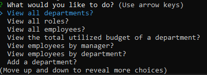

  # Employee Tracker

  ## Description
This project is a command-line application that uses Node.js, Inquirer, and MySQL that can manage a company's employee database. You can view all employees, managers, department, total budget utilization. You can add employees, updated employees, and remove employees. You can also remove roles and departments. You can also update the managers and roles of employees.

  ## Table of Contents
  * [Project Links](#links)
  * [Usage](#usage)
  * [Screenshots](#screenshots)
  * [Credits](#credits)
  * [License](#license)
  * [Contributing](#contributing)
  * [Tests](#tests)
  * [Questions](#questions)

  ## Links
  * [Walkthrough Video]()
  * [GitHub Repo](https://github.com/jeaustins27/Employee-Tracker)

  ## Usage
To get started, clone the repo onto your machine. Once cloned, you will need to generate the database by using the prompts in the "schema.sql". You will then need to seed the database with the code in "seed.sql". Once your database has been created and seeded, you will need to install the necessary packages by using "npm install" in the command line. Once all packages have been installed, use "node server.js" in the command line to run the application. Use the arrow keys to navigate through the selections, to select press the ENTER key. 

  ## Screenshots
  

  ## Credits
  * [W3Schools](https://www.w3schools.com/)
  * [Readme.so](https://readme.so/)
  * [Stack Overflow](https://stackoverflow.com)

  
  ## License
  
  
  This project is licensed under the [MIT](https://choosealicense.com/licenses/mit/) license.

    

  ## Contributing
  You can help with contributing by reaching me via email.

  ## Tests
  There are no current tests to be ran.

  ## Questions
  If you have any questions you can reach out via [Email](mailto:JeaustinS27@gmail.com) or you can check out my GitHub profile at here: [GitHub](https://github.com/jeaustins27)
